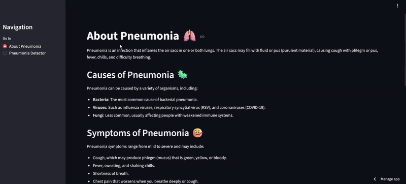

# 🩺 Pneumonia Detection from Chest X-Ray Images




Chest X-ray pneumonia detection using Convolutional Neural Networks (CNN) and transfer learning. The project builds a deep learning pipeline with preprocessing, model training, and evaluation, achieving high accuracy and demonstrating the effectiveness of AI in medical image classification.
Pneumonia Detection from Chest X-Ray Images

## 📝 Problem Statement

Pneumonia is a serious lung infection that can be life-threatening if not diagnosed early. Manual detection from X-rays is time-consuming and requires medical expertise. The goal of this project is to build an AI-based system that can automatically detect pneumonia in chest X-ray images with high accuracy

## 📁 Project Structure 
```
├── Chest_X_Ray_Pneumonia_CNN_Transfer_learning.ipynb   # Main Jupyter Notebook
├── models/                                             # Saved trained models
├── assets/                                             # Contains demo.gif and sample images
├── requirements.txt                                    # Python dependencies
└── README.md                                           # Project documentation
├── ChestX_Ray.py                                       # Model deployment using streamlit
```
---

## 🧩 1: Data Preprocessing & Exploration

- **Overview**:
  - Dataset: [Kaggle Chest X-Ray Pneumonia Dataset](https://www.kaggle.com/paultimothymooney/chest-xray-pneumonia)
  - Preprocessing steps:
    - Resizing images to (224x224).
    - Normalization and scaling.
    - Data augmentation (rotation, flipping, zoom, shift)
  - Class distribution analysis (Normal vs Pneumonia)

- **Deliverables**:
  - Clean and augmented dataset.
  -  Visualizations of samples and class imbalance.
## 2: Model Building (CNN & Transfer Learning)

- **Custom CNN**:
  
  - Built a baseline CNN model from scratch
  - Used Conv2D, MaxPooling, Dropout, and Dense layers
    
- **Transfer Learning**:
  - Used pre-trained models: DenseNet121, VGG16, ResNet50
  - Fine-tuned final layers for pneumonia classification
  - Added dropout layers to reduce overfitting
- **Key Techniques**:

  - Early stopping and learning rate reduction callbacks
  - Optimizer: Adam
  - Loss: SparseCategoricalCrossentropy / CategoricalCrossentropy (depending on label encoding)


## 3: Model Evaluation

- **Metrics**:
  - Accuracy, Precision, Recall, F1-score
  - Confusion matrix visualization

- **Results**:
  - Transfer learning models outperformed baseline CNN
  - Best model: DenseNet121 with validation accuracy ~95% / test accuracy ~94%


## 4: Deployment
- Saved trained model (.keras / .h5):
- Can be deployed with Streamlit or Flask for real-time predictions:
- Input: Chest X-ray image:
- Output: Probability of Normal vs Pneumonia:

## 🛠️ Technologies Used
- Python
- TensorFlow / Keras
- NumPy / Pandas
- Matplotlib / Seaborn
- Scikit-learn
- Transfer Learning Models (DenseNet121, VGG16, ResNet50)


## 🚀 How to Run
1. Clone the repository:
   ```bas
   git clone https://github.com/AbdelrahmanMohamed75/ Chest_X_Ray_Pneumonia_CNN_Transfer_learning.git
   cd  Chest_X_Ray_Pneumonia_CNN_Transfer_learning
   ```

2. Install dependencies:
   ```bash
   pip install -r requirements.txt
   ```
3. Run the notebook:
   ```bash
   jupyter notebook Chest_X_Ray_Pneumonia_CNN_Transfer_learning.ipynb
   ```
---
4.Try the app: [https://cardshield-app.streamlit.app/](https://xeqmlxsobfhj5qxxcjmxyp.streamlit.app/)

## 👨‍💻 Author
 Made with ❤️ by [Abdelrahman Mohamed Emam]

Feel free to fork ⭐, contribute, or suggest improvements


